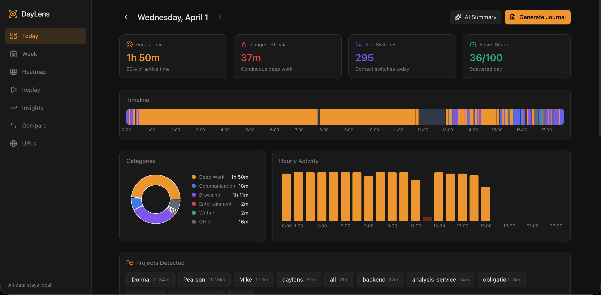
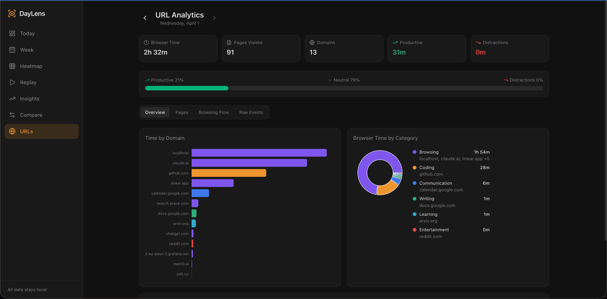

# Retra — Your Day, In Focus

A local-first macOS app that passively captures your daily computer activity, intelligently categorizes it, detects projects, and generates AI-powered reflections. All data stays on your machine.



## Why Retra?

Ever wonder where your day went? Retra runs silently in the background and gives you an honest picture of how you spent your time — no manual tracking, no timers to start/stop. Just open the dashboard at end of day and see the truth.

## Features

- **One-Command Startup** — `python main.py start` launches everything (capture daemon + dashboard + menubar)
- **Passive Window Tracking** — Logs active app + window title every 3 seconds
- **Smart Categorization** — Auto-categorizes into Deep Work, Communication, Browsing, Entertainment, Writing, Learning
- **Project Auto-Detection** — Parses project/repo names from VS Code, Cursor, terminal, and GitHub window titles
- **Browser Context** — Captures actual URLs and domains when browsing, not just "Brave Browser"
- **Periodic Screenshots** — Every 3 minutes, compressed and downscaled (80-150KB each)
- **Screenshot Dedup** — Skips capture when the screen hasn't changed
- **Idle Detection** — Pauses tracking when you step away
- **AI Reflections** — Daily summaries via Claude API or local Ollama with rich context (URLs, projects, patterns)
- **Obsidian Integration** — Auto-generates daily notes with timeline, stats, and reflections
- **Web Dashboard** — React-based local dashboard with 7 pages of analytics
- **URL Analytics** — Deep browsing analysis with productivity scoring, page-level tracking, and browsing flow visualization
- **Menubar App** — Live recording indicator, focus time display, health monitoring
- **Recording Health** — Know for sure your activity is being captured (heartbeat monitoring, status checks)
- **LLM Wiki** — Compiles daily notes into a persistent knowledge base with project pages, pattern tracking, learning logs, and people
- **Wiki Dashboard** — Browse, search, and query the wiki from the dashboard with full markdown rendering
- **Ask Your Data** — Chat-style Q&A against your activity wiki powered by Claude
- **Incognito Detection** — Automatically skips all recording for private/incognito browser windows
- **Privacy Controls** — Blocklist for apps/URLs, all data stays on your machine
- **Auto-Start** — Install as macOS Launch Agent, survives sleep/wake and reboots
- **Automated Pipeline** — Scheduled daily journal export + wiki compilation at 23:00, auto weekly rollups on Sundays
- **Storage Optimized** — ~15-20MB/day instead of ~65MB (downscaled screenshots, dedup, auto-cleanup)

## Dashboard Pages

| Page         | What It Shows                                                                                  |
| ------------ | ---------------------------------------------------------------------------------------------- |
| **Today**    | Focus score, timeline, categories, hourly activity, detected projects, sessions, AI reflection |
| **Week**     | 7-day overview with daily focus scores and trends                                              |
| **Heatmap**  | 180-day focus score heatmap                                                                    |
| **Replay**   | Screenshot-based visual replay of your day                                                     |
| **Insights** | 30-day trends, category totals, app usage, period comparison                                   |
| **Compare**  | Side-by-side comparison of any two days                                                        |
| **URLs**     | Deep browsing analytics — productivity split, top pages, browsing flow, hourly breakdown       |
| **Wiki**     | Browse/search the compiled wiki, ask questions, focus trend chart, compile status               |



## Architecture

```
                            Retra
  ┌──────────────────────────────────────────────────┐
  │                                                  │
  │  Capture Daemon ──> SQLite DB ──> FastAPI        │
  │   - Window titles     (WAL mode)   Dashboard     │
  │   - URLs/domains                   (React)       │
  │   - Screenshots                                  │
  │   - Idle detection   Summarizer ──> Obsidian     │
  │   - Incognito skip   (Claude/Ollama) Export      │
  │   - Heartbeat                        │           │
  │                                      ▼           │
  │  Menubar App (rumps)          Wiki Compiler      │
  │   - Live focus time            - Project pages   │
  │   - Recording health           - Pattern tracking│
  │   - Compile Wiki               - Weekly rollups  │
  │                                - Ask / Query     │
  └──────────────────────────────────────────────────┘
```

## Tech Stack

| Layer           | Tech                                         |
| --------------- | -------------------------------------------- |
| Capture Daemon  | Python + pyobjc (macOS Quartz & AppKit APIs) |
| Database        | SQLite with WAL mode, persistent connections |
| API Server      | FastAPI + Uvicorn                            |
| Dashboard       | React + Recharts + Tailwind CSS              |
| AI Summary      | Claude API or Ollama (local)                 |
| Obsidian Export | Markdown generation with frontmatter         |
| Menubar App     | rumps (Python macOS menubar)                 |

## Quick Start

### Prerequisites

- **macOS** (uses native macOS APIs for window tracking and screenshots)
- **Python 3.11+**
- Node.js 18+ (only needed if modifying the dashboard)

### Setup & Run

```bash
git clone https://github.com/yourusername/retra.git
cd retra
make setup    # creates venv, installs deps, copies config files
make start    # launches capture daemon + dashboard + menubar
```

That's it. Open **http://localhost:5173** to see the dashboard.

> **Why not Docker?** Retra captures your screen activity using macOS-native APIs (Quartz, Accessibility, screencapture). These don't work inside a Linux container. The Makefile gives you a one-command setup that's just as easy.

### Grant macOS Permissions

Retra needs **Accessibility** and **Screen Recording** permissions:

1. **System Settings > Privacy & Security > Accessibility** — Add your terminal app (or Cursor/VS Code)
2. **System Settings > Privacy & Security > Screen Recording** — Add your terminal app

### AI Summaries (Optional)

Add your Anthropic API key to `.env` for AI-powered daily reflections:

```bash
echo 'ANTHROPIC_API_KEY=sk-ant-...' > .env
```

Or use a local model via Ollama — set `provider = "ollama"` in `config/settings.toml`.

### Common Commands

```bash
make start      # Start everything (capture + dashboard + menubar)
make stop       # Stop all processes
make status     # Show recording health and today's stats
make journal    # Generate today's Obsidian journal
make help       # Show all available commands
```

### Auto-Start on Login

```bash
make install    # Install as macOS Launch Agents (survives sleep/wake/reboot)
make uninstall  # Remove Launch Agents
```

### Manual Setup (without Make)

```bash
python3 -m venv venv
source venv/bin/activate
pip install -r requirements.txt
cp .env.example .env
cp config/settings.example.toml config/settings.toml
python main.py start
```

## CLI Reference

| Command                             | Description                                             |
| ----------------------------------- | ------------------------------------------------------- |
| `python main.py start`              | Start capture daemon + dashboard + menubar (background) |
| `python main.py stop`               | Stop all Retra processes                                |
| `python main.py status`             | Show recording health and today's stats                 |
| `python main.py capture`            | Start capture daemon (foreground)                       |
| `python main.py dashboard`          | Start web dashboard (foreground)                        |
| `python main.py menubar`            | Start menubar app                                       |
| `python main.py journal`            | Generate today's Obsidian journal                       |
| `python main.py journal YYYY-MM-DD` | Generate journal for a specific date                    |
| `python main.py compile`            | Compile today's daily note into wiki                    |
| `python main.py compile YYYY-MM-DD` | Compile a specific date into wiki                       |
| `python main.py compile-week`       | Generate weekly rollup                                  |
| `python main.py lint`               | Health check the wiki                                   |
| `python main.py ask "question"`     | Query the wiki with a question                          |
| `python main.py backfill`           | Compile all existing daily notes into wiki              |
| `python main.py install`            | Install as macOS Launch Agents (auto-start on login)    |
| `python main.py uninstall`          | Remove Launch Agents                                    |

## Configuration

All settings in `config/settings.toml`:

```toml
[capture]
poll_interval = 3              # seconds between window checks
screenshot_interval = 180      # seconds between screenshots
idle_threshold = 300           # seconds before marking idle
screenshot_quality = 40        # JPEG quality (1-100)

[privacy]
blocked_apps = ["1Password", "Keychain Access"]
blocked_url_patterns = ["bank", "chase.com"]
retention_days = 90            # auto-delete data older than this

[categories]
coding = ["VS Code", "Code", "Xcode", "Terminal", "iTerm", "PyCharm", "Cursor", "Warp"]
communication = ["Slack", "Discord", "Messages", "Zoom", "Teams", "Telegram"]
browsing = ["Safari", "Chrome", "Firefox", "Arc", "Brave"]
entertainment = ["Spotify", "Music", "VLC", "IINA"]
writing = ["Obsidian", "Notion", "Bear", "Notes", "Craft"]
learning = ["Anki", "Kindle", "Books"]

[ai]
provider = "claude"                     # "claude" or "ollama"
claude_model = "claude-sonnet-4-20250514"
ollama_model = "llama3.1:8b"

[obsidian]
vault_path = "~/Documents/Obsidian/MyVault"
daily_notes_folder = "Retra"

[dashboard]
port = 5173
```

## Project Structure

```
retra/
├── main.py                     # CLI entry point (start/stop/status/install)
├── requirements.txt
├── .env                        # API keys (not committed)
├── .env.example
├── config/
│   ├── settings.py             # Config loader with .env support
│   └── settings.toml           # User configuration
├── capture/
│   ├── daemon.py               # Main capture loop (heartbeat, URL enrichment)
│   ├── window_tracker.py       # macOS window tracking (CGWindowList API)
│   ├── screenshot.py           # Screenshot capture + downscale + compression
│   ├── idle_detector.py        # User idle detection via HIDIdleTime
│   └── health.py               # Health check system (daemon alive, events flowing)
├── storage/
│   ├── database.py             # SQLite schema, queries, persistent connections
│   └── models.py               # Data models (WindowEvent, Session, DailySummary)
├── export/
│   ├── obsidian.py             # Markdown journal generation (auto-triggers wiki compile)
│   ├── summarizer.py           # AI summary (Claude/Ollama) + project detection
│   └── wiki_compiler.py        # LLM wiki compiler (ingest, rollup, lint, query)
├── ui/
│   ├── server.py               # FastAPI server (30+ endpoints)
│   ├── menubar.py              # macOS menubar app with health indicator
│   └── dashboard/              # React dashboard
│       └── src/
│           ├── pages/          # 8 pages (Today, Week, Heatmap, Replay, Insights, Compare, URLs, Wiki)
│           ├── components/     # SessionCard, GoalsPanel, Toast, Layout
│           ├── api.js          # API client
│           └── hooks.js        # Date navigation, data fetching, utilities
└── data/                       # Created at runtime
    ├── retra.db              # SQLite database
    ├── screenshots/            # Organized by date (YYYY-MM-DD/)
    ├── daemon.heartbeat        # Health monitoring
    └── daemon.pid              # Process management
```

## How It Works

### Capture Pipeline

Every 3 seconds, the daemon:

1. Queries the macOS window server (CGWindowListCopyWindowInfo) for the frontmost window
2. For browsers, fetches the actual URL via AppleScript and enriches the window title with the domain
3. Categorizes the activity (coding, browsing, entertainment, etc.)
4. Records the event to SQLite (with dedup — skips identical consecutive events, records continuation heartbeats every 60s)
5. Every 3 minutes, captures a screenshot, downscales to 1280px max width, compresses to ~80-150KB

### Session Aggregation

Raw events are aggregated into sessions:

- Same app within 5 minutes = one session
- Consecutive same-app sessions are merged (even across gaps)
- Sessions < 1 minute are filtered out
- Browser sessions track unique domains visited
- Sessions are grouped by app in the dashboard (one "Cursor" entry, not ten)

### Project Detection

Projects are auto-detected from window titles using 4 patterns:

- **Editor titles**: `filename.ext — project-name` (VS Code, Cursor)
- **GitHub URLs**: `github.com/owner/repo`
- **Git branches**: `git:(feature/xyz)` in terminal titles
- **File paths**: `~/projects/myapp` in terminal titles

### AI Summary

When you click "AI Summary" or run `python main.py journal`, the summarizer:

- Builds a rich context from your day: sessions, category breakdown, top domains, time-on-site, detected projects
- Sends it to Claude API (or local Ollama) with a coaching-style prompt
- Returns a 200-350 word reflection with highlights and actionable suggestions

### LLM Wiki

Retra's daily notes are standalone — Day 2 doesn't know about Day 1. The wiki layer fixes this by compiling daily exports into persistent, cross-referenced knowledge pages:

```
Obsidian Vault/
├── Retra/                  ← Daily exports (raw, never modified)
│   ├── 2026-04-01.md
│   └── ...
└── retra-wiki/             ← LLM-maintained wiki (compiled layer)
    ├── CLAUDE.md           ← Schema that tells the LLM how to maintain the wiki
    ├── index.md            ← Master index of all pages
    ├── projects/           ← One page per project/workstream
    ├── patterns/           ← Focus trends, distraction patterns, schedule analysis
    ├── learning/           ← Topics being learned over time
    ├── people/             ← Collaboration context
    ├── rollups/            ← Weekly and monthly summaries
    └── insights/           ← Saved answers to past queries
```

**How it works:**

1. `python main.py journal` exports the daily note, then auto-triggers wiki compilation
2. The wiki compiler sends the daily note + schema + existing wiki pages to Claude
3. Claude updates project pages, pattern tracking, learning logs, and people pages
4. On Sundays, a weekly rollup is auto-generated
5. `python main.py install` schedules the full pipeline (journal + compile) daily at 23:00

**Querying the wiki:**

```bash
python main.py ask "How much time did I spend on Pearson this week?"
python main.py ask "What are my distraction patterns?"
```

Or use the **Wiki** page in the dashboard to browse, search, and ask questions interactively.

## Privacy

- **100% local** — All data stored in SQLite on your machine
- **No telemetry** — Nothing leaves your computer (unless you enable Claude API for summaries/wiki)
- **Incognito safe** — Private/incognito browser windows are never recorded (no events, URLs, or screenshots)
- **Blocklist** — Exclude sensitive apps and URLs from tracking
- **`.env` for secrets** — API keys stored in `.env`, never committed
- **Data retention** — Auto-deletes data older than 90 days (configurable)
- **Open source** — Audit every line of code

## Storage

| Component        | Size            | Notes                                        |
| ---------------- | --------------- | -------------------------------------------- |
| Screenshots      | ~15-20 MB/day   | Downscaled to 1280px, JPEG quality 40, dedup |
| Database         | ~1-2 MB/day     | SQLite with WAL mode                         |
| 90-day retention | ~1.5-2 GB total | Auto-cleanup on daemon startup               |

## Contributing

Contributions welcome! Some ideas:

- [ ] Distraction alerts (macOS notification after X min on entertainment)
- [ ] Focus timer / Pomodoro integration
- [ ] Meeting detection (Zoom/Meet/Teams auto-tagging)
- [ ] Calendar integration (Google Calendar overlay on timeline)
- [ ] CSV/JSON data export
- [ ] Monthly rollup command
- [ ] Token budget optimization for wiki (send only relevant pages)
- [ ] Linux support (replace macOS-specific APIs)

## License

MIT
